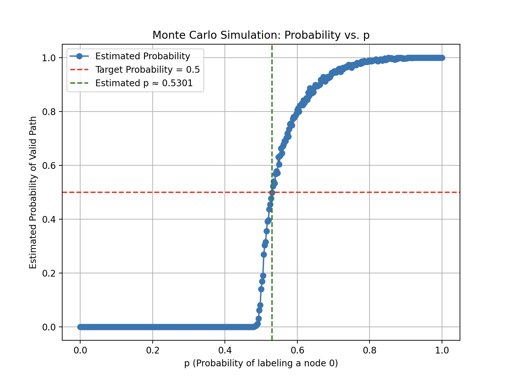

## April 2025: Sum One, Somewhere
Date: April 2025  
Link: [click here](https://www.janestreet.com/puzzles/someone-somewhere-index/)  
Solved on: April 11, 2025

---

### The Puzzle

The puzzle description is pretty short, so here it is in full:

*For a fixed _p_, independently label the nodes of an infinite complete binary tree 0 with probability _p_, and 1 otherwise. For what _p_ is there exactly a 1/2 probability that there exists an infinite path down the tree that sums to **at most 1** (that is, all nodes visited, with the possible exception of one, will be labeled 0). Find this value of _p_ accurate to **10 decimal places**.*

### Initial Observations/Questions

- This is a straight math/programming question, and I didn't think that the puzzle name or description held any clues/hints for this type of puzzle.


### Strategy

> Note: The following strategy may not be the most efficient process to solve the problem, but it is how I went about it in my head.

The first thing I did was think *"what is the probability, in  respect to p, that there exists a path down the tree that sums to at most 1."* For this, there are two cases.

#### Case A: Path is All Zeros

Let the probability that the path is all zeroes be denoted by $P_0(p)$, where $p$ is stated in the prompt.

This can be further split into three sub-cases:

1. Path of zeroes exists **only on the left side**

2. Path of zeroes exists **only on the right side**

3. Path of zeroes exists **on both sides**

We calculate the probabilities as follows:

1.  **Only on the left side**:

$$
P_{\text{left}} = P_0(p) \cdot (1 - P_0(p))
$$


2.  **Only on the right side**:

$$
P_{\text{right}} = (1 - P_0(p)) \cdot P_0(p)
$$

3. **On both sides**:

$$
P_{\text{both}} = P_0(p) \cdot P_0(p) = P_0(p)^2
$$

Now, the **total probability** that the path is all zeroes (in any of the above forms) is the sum of the three:

$$
P_0^{\text{total}}(p) = P_{\text{left}} + P_{\text{right}} + P_{\text{both}} = 2 \cdot P_0(p) \cdot (1 - P_0(p)) + P_0(p)^2
$$

Now, we simplify the total probability expression:

$$
P_0^{\text{total}}(p) = 2P_0(p)(1 - P_0(p)) + P_0(p)^2
$$

Expanding:

$$
= 2P_0(p) - 2P_0(p)^2 + P_0(p)^2 = 2P_0(p) - P_0(p)^2
$$

Letting $P_0(p) = P$ for simplicity, we get:

$$
P_0^{\text{total}}(p) = 2P - P^2
$$

Now, recall the recursive formulation: a path of all 0s exists if the root is 0 (probability $p$ and at least one child subtree contains a path of all 0s. The probability that neither subtree contains such a path is $(1 - P)^2$), so the probability that at least one does is $1 - (1 - P)^2$. Therefore:

$$
P = p \cdot (1 - (1 - P)^2) = p \cdot (2P - P^2)
$$

Bringing all terms to one side:

$$
P - p(2P - P^2) = 0
$$

Expanding:

$$
P - 2pP + pP^2 = 0
$$

Rewriting:

$$
P(pP + (1 - 2p)) = 0
$$

So either:

$$
P = 0 \quad \text{or} \quad pP + (1 - 2p) = 0
$$

Solving the second equation:

$$
pP = 2p - 1 \\
P = \frac{2p - 1}{p}
$$

Therefore, the total probability $P_0$ is either:

$$
P_0 = 0 \quad \text{or} \quad P_0 = \frac{2p - 1}{p} = 2 - \frac{1}{p}
$$

Now, back to the other case.

#### Case B: Path Exists with at Most 1 One:

The goal here is to define $P_1(p)$, and so along with $P_0(p)$ above, we'll be able to solve for $p$.

Thus, let $P_1(p)$ be the probability that a given node’s subtree contains *some*  path that uses at most one node labeled 1. To start, let's look at the root node.
  
| root label | probability | requirement on (at least one) child subtree |
|-----------|-------------|---------------------------------------------|
| **1** | \(1-p\) | the path has *already* spent its single 1, so the child subtree must supply an **all‑zero** path ⇒ probability $P_0$ |
| **0** | \(p\) | the path may still contain **≤ 1 One** in the descendants ⇒ probability $P_1$ |

So, we can combine both cases into a simple equation, where the first term is if the root is $0$ and the second if the root term is $1$:
 
$$
P_1 \;=\; p\,\bigl(2P_1-P_1^{2}\bigr)\;+\;(1-p)\,\bigl(2P_0-P_0^{2}\bigr).
$$

Move all terms to one side:

$$
0 = -pP_1^2 + P_1(2p-1) + (1-p)P_0(2-P_0)
$$

Since we know $P_0 = 2 - \tfrac1p$ for $p>\tfrac12$, we have:

$$
2P_0 - P_0^2 = \frac{2p - 1}{p^2}
$$

so,

$$
-p\,P_1^2 + (2p - 1)\,P_1 + (1-p)\,\frac{2p-1}{p^2} = 0
$$

Now that all $P_0$ are substituted for, we can set $P_1 = \tfrac12$ *(the puzzle’s “exactly 1/2” condition)*:

$$
-\,p\Bigl(\tfrac14\Bigr) \;+\; (2p-1)\Bigl(\tfrac12\Bigr)
\;+\; \frac{(1-p)(2p-1)}{p^2} = 0.
$$

Remove denominator by multiplying through by $4p^2$:

$$
-p^3 + 2p^2(2p-1) + 4(1-p)(2p-1) = 0
\;\Longrightarrow\;
3p^3 - 10p^2 + 12p - 4 = 0.
$$

Therefore the cubic equation is
$$
\boxed{3p^3 - 10p^2 + 12p - 4 = 0}
$$

whose unique root in $(\tfrac12,1)$ is

$$
p \approx 0.5306035754.
$$

### Checking the Answer

I wanted to check my answer to make sure that I hadn't made any mistakes in the math process. 

First, I made a recursive function that simulates a single traversal down a complete binary tree, with each node's value generated on the fly according to the given $p$. It returns `True` if there exists a path down the tree with at most $k$ ones.

```python
def simulate_valid_path(depth, k, p):
	if depth == 0:
		return True
	
	val = 0 if random.random() < p else 1

	if val == 1:
		k -= 1
	if k < 0:
		return False
	return simulate_valid_path(depth - 1, k, p) or simulate_valid_path(depth - 1, k, p)
```
Then, you can estimate the probability that a given path exists by running many independent simulations with a given $p$. The following function returns the fraction of runs where a valid path down the tree (at most $k$ ones) was found.

```python
def estimate_probability(p, depth, k, trials):
	success = 0
	
	for _ in range(trials):
		if simulate_valid_path(depth, k, p):
			success += 1
			
	return  success / trials
```

Then, we can run a monte-carlo simulation with the above functions:

```python
# Simulation parameters
depth = 250 # depth of binary tree simulation
k = 1 # the problem allows for up to 1 one
trials = 1000 # trials to test
p_values = np.arange(0.0, 1.0001, 0.0025) # values of p to test
estimated_probs = []
```

```python
# Running simulation for different p values...
for p in p_values:
	prob = estimate_probability(p, depth, k, trials)
	estimated_probs.append(prob)

estimated_p = np.interp(0.5, estimated_probs, p_values)
```
```python
plt.figure(figsize=(8, 6))
plt.plot(p_values, estimated_probs, marker='o', linestyle='-', label="Estimated Probability")
plt.axhline(0.5, color='red', linestyle='--', label="Target Probability = 0.5")
plt.axvline(estimated_p, color='green', linestyle='--', label=f"Estimated p ≈ {estimated_p:.4f}")
plt.xlabel("p (Probability of labeling a node 0)")
plt.ylabel("Estimated Probability of Valid Path")
plt.title("Monte Carlo Simulation: Probability vs. p")
plt.grid(True)
plt.legend()
plt.show()
```

Running the code shows the visualization, predicting a very close number to what was calculated before. 




### Answer

Thus, I was confident the answer was **$0.5306035754$**.


---

### About Me

I am currently a Sophomore at Northeastern University studying Computer Science and Mathematics, with a goal to work in the quantitative finance field. I love working through these type of problems and using code to make the solution more elegant. More information on me and some projects I'm proud of can be found on my website below.

[Personal Website](https://www.maxcyrusmayer.com)
[LinkedIn](https://www.linkedin.com/in/max-mayerr/)
[Contact Me](mailto:max@maxcyrusmayer.com)
