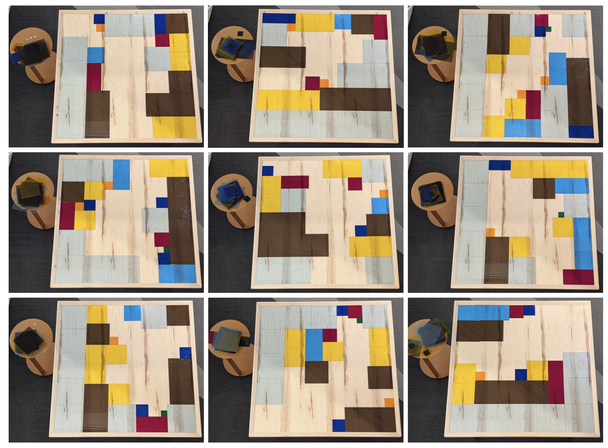
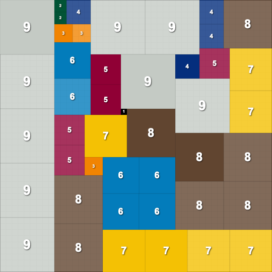

## June 2025: Some Ones, Somewhere
Date: June 2025  
Link: [click here](https://www.janestreet.com/puzzles/some-ones-somewhere-index/)  
Solved on: June 16, 2025

---

### The Puzzle

We are told that the answer to this month's puzzle is a sentence, and the puzzle is within the image below:

### Initial Observations/Questions

- Some random housekeeping things I checked first:
	- The title similarity to the April 2025 puzzle [Sum Ones, Somewhere](https://puzzles.maxcyrusmayer.com/solutions/apr25.html), so I reviewed it just incase, but didn't find any useful hints.
	- Hidden image metadata doesn't give any useful info either.
- Some questions I asked myself:
	- What do the scrabble tiles around the side of the boards mean?
	- Do the number of colorful tiles in each board mean anything? Does the ordering of each board within the 9 total matter?

### Strategy

> Note: The following strategy may not be the most efficient process to solve the problem, but it is how I went about it in my head.

The most obvious starting place is to collect the scrabble tiles found scattered around the board:

*Top Edge:*
***P, A, R, T, R, I, D, G, E***
Left Edge:
***T, I, L, I, N, G***
*On the tables:*
***T, H, E*** & ***A***

It is clear we have a hint here: ***partridge tiling***.

With some quick research of partridge tiling, I understood that the next task would be to "solve" each one of these grids. While I was initially going to use Adobe Illustrator by hand, I was relieved when one of my colleagues showed me [this website](https://partridge.vercel.app).

Using this website, and some mild spacial reasoning, I was able to solve each grid. An example of the first panel is shown below:

With each panel solved, I referred back to the title **Some Ones, Somewhere**. Given the each correctly solved panel can only have a 1x1 block in a single spot, I extracted the location of this tile. Also included in the tale below is the position of that tile in terms of all the other panels (the second panel is +45 in the x direction, panels are 45x45).

**the following coordinates are row (y), col (x), starting from the top left of the grid, instead of the standard x, y from the bottom left. This is a standard computer science practice*

|  | Panel Position (isolated) | Position (in all) |
|--|--|--|
|**Panel 1**| (21, 19) | (21, 19) |
|**Panel 2**| (13, 22) | (13, 67) |
|**Panel 3**| (32, 17) | (32, 107) |
|**Panel 4**| (28, 28) | (73, 28) |
|**Panel 5**| (12, 26) | (57, 71) |
|**Panel 6**| (16, 33) | (61, 123) |
|**Panel 7**| (7, 17)  | (97, 17) |
|**Panel 8**| (9, 34)  | (99, 79) |
|**Panel 9**| (6, 19)  | (96, 109) |

Now that I had the positions, I turned to the scrabble tiles on the ridge of the boards. I thought it was too deliberate how the tiles were spaced out - and I ended up being correct.

For example, looking at the "P" in the first panel, based on the tile sizes in the grid, we know it's placed at position x = 16. P is also the 16th letter of the alphabet. This is the same for the T on the left side. It is at position y = 20 and it is the 20th letter of the alphabet. Thus, we can assign the letters A-Z to positions $x \mod 26$ and $y \mod 26$ (we use mod so the alphabet 'wraps around' to letters after position 26. So x = 27 is A, x = 28 is B, etc).

Given this, we can assign letters to each coordinate pair:

|  | Panel Position (isolated) | Position (in all) | Letters |
|--|--|--|--|
|**Panel 1**| (21, 19) | (21, 19) | S, U |
|**Panel 2**| (13, 22) | (13, 67) | M, O |
|**Panel 3**| (32, 17) | (32, 107) | F, C |
|**Panel 4**| (28, 28) | (73, 28) | U, B |
|**Panel 5**| (12, 26) | (57, 71) | E, S |
|**Panel 6**| (16, 33) | (61, 123) | I, S |
|**Panel 7**| (7, 17)  | (97, 17)  | S, Q |
|**Panel 8**| (9, 34)  | (99, 79)  | U, A |
|**Panel 9**| (6, 19)  | (96, 109) | R, E |

You can take a glance at the letters column and see the almost-sentence:

***SUM OF CUBES IS SQUARE***

And by bringing back the ***THE*** and ***A*** from the beginning, you get the final sentence.

### Answer

Thus, the final answer is **THE SUM OF CUBES IS A SQUARE**.

---

### About Me

I am currently a rising Junior at Northeastern University studying Computer Science and Mathematics, with a goal to work in the quantitative finance field. I love working through these type of problems and using code to make the solution more elegant. More information on me and some projects I'm proud of can be found on my website below.

[Personal Website](https://www.maxcyrusmayer.com)
[LinkedIn](https://www.linkedin.com/in/max-mayerr/)
[Contact Me](mailto:max@maxcyrusmayer.com)
